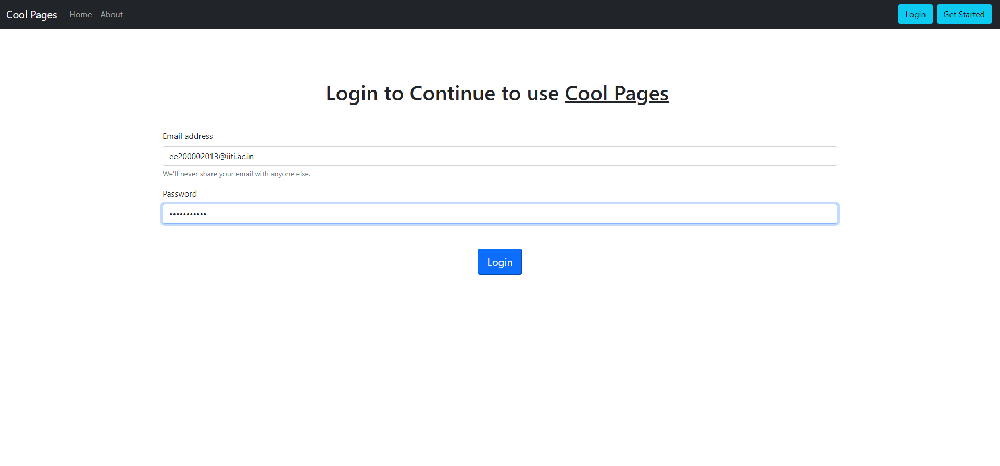
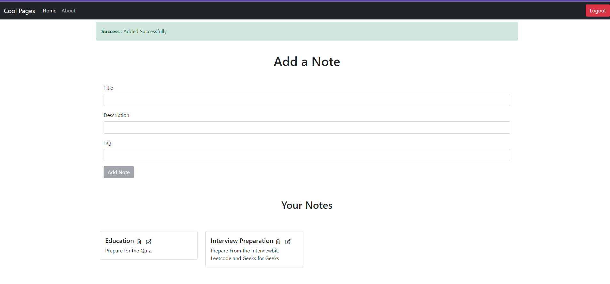
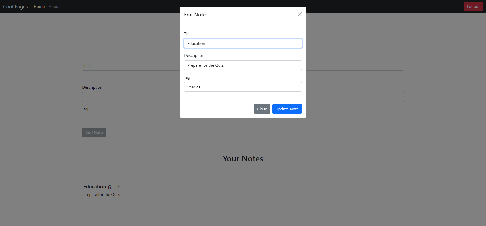
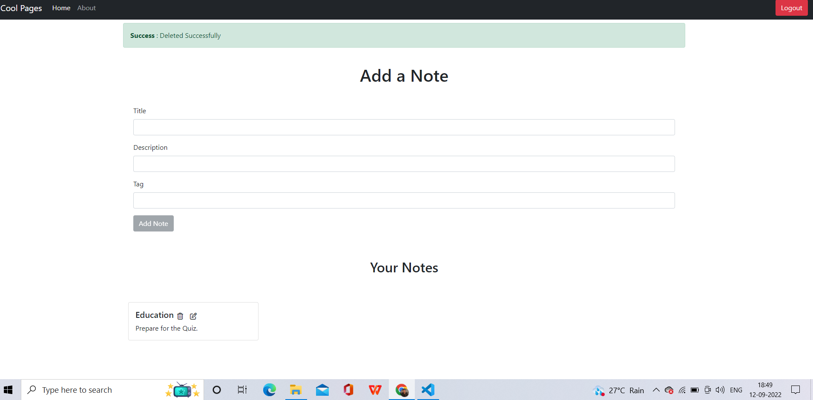

# Cool-Pages - Secured Notes on Cloud
## **Tech Stacks** : 
* HTML
* CSS
* JavaScript
* MongoDb
* Express Js
* Node Js
* React Js
* Bootstrap
* Git / GitHub
___
## **Description** : 
* Stored on cloud
* Easy to use and Secured
* Notes categorised on basis of tags
* Notes can be Created, Updated, Read and Deleted
* Completely free
___
## **Previews** : 
### Sign Up

### Login

### About

### Add a Note


### Update Note


### Delete Note

___
## **Download Links** : 
You can access my project from your local machine !
>https : https://github.com/adarsh-2201/Cool-Pages
```bash
    git clone https://github.com/adarsh-2201/Cool-Pages.git
```
___